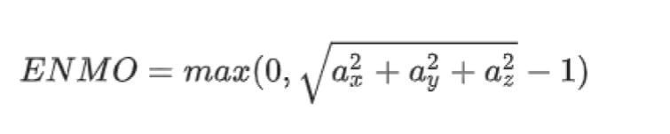
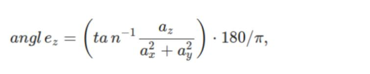
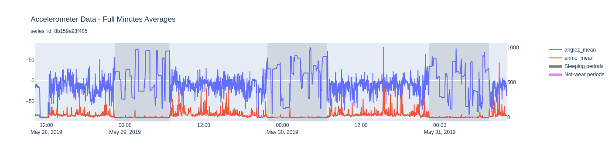

# ML Zoomcamp midterm project - Sleep Detection
This is a midterm project of ML Engineering Zoomcamp by DataTalks - Cohort 2023

The goal of this project is to detect sleep from the data recorded by wrist-worn accelerometer for sleep monitoring. 
This is a simplified problem of the one from the Kaggle competition - ["Child Mind Institute - Detect Sleep States - overview"](https://www.kaggle.com/competitions/child-mind-institute-detect-sleep-states).

## Dataset
The original dataset comes from Kaggle competition "Child Mind Institute - Detect Sleep States - data". 
Training dataset comprises of every 5 seconds accelerometer signals transformed into two variables:
- <b>ENMO</b>: The Euclidean Norm Minus One (ENMO) with negative values rounded to zero.
   It has been shown to correlate with the magnitude of acceleration and human energy expenditure.
   ENMO is computed as follows: 
  <!-- width="350" height="350" -->
  
- <b>anglez</b>: Z-angle, computed using the equation below; corresponds to the angle between the accelerometer axis perpendicular to the skin surface and the horizontal plane.
   Any change (or lack of change) in the z-angle over successive time intervals may be an indicator of posture change. 
  
 <!-- width="1400" height="1000" -->

It is too large to train a model on it with a single computer so here only the subset of data is included. 
Additionally, to decrease the size of the dataset we calculate one minute statsistics. 
The final dataset that will be used here have the following fields:

| variable | describtion |
|:---|:---|
| series_id | Unique identifier for each accelerometer series. |
| step | An integer timestep for each observation within a series. |
|dt_minute|...|
|anglez_mean|...|
anglez_std	
anglez_max	
anglez_min	
enmo_mean	
enmo_max	
enmo_min	
anglez_1st_diffs_sum	
enmo_1st_diffs_sum	
step_min	
hour	
target

