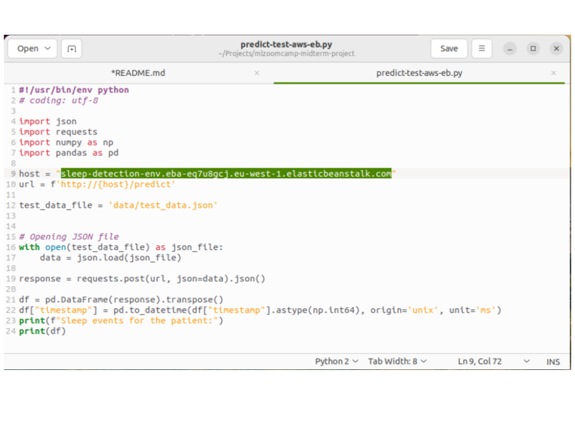
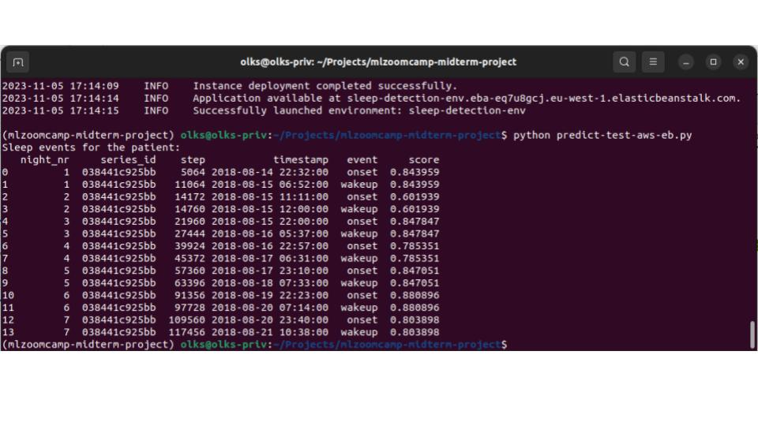

# ML Zoomcamp midterm project - Sleep Detection
This is a midterm project of [ML Engineering Zoomcamp by DataTalks](https://github.com/DataTalksClub/machine-learning-zoomcamp) - Cohort 2023

The goal of this project is to detect sleep from the data recorded by wrist-worn accelerometer for sleep monitoring. 
The data comes from the Kaggle competition - ["Child Mind Institute - Detect Sleep States - overview"](https://www.kaggle.com/competitions/child-mind-institute-detect-sleep-states).

## Instructions how to run the project locally 
- You need to have a Docker installed on your computer.
1. Clone the repository, run:
	- `git clone https://github.com/Olks/mlzoomcamp-midterm-project.git`
2. Go to project directory and build docker image from Dockerfile, run:   (it may take a few minutes)
	- `docker build -t sleep-detection .`
3. Start a container from the sleep-detection image with:
	- `docker run -it --rm -p 9696:9696 sleep-detection`  
4. To run test prediction (reading sample accelerometer data from data/test_data.json file) open another terminal and run:
	- `python predict-test.py` 
		- need to have Python, requests, pandas and numpy installed locally; check predict-test-requirements.txt and .python_version files
		- returns -> table of onset and wakeup events 
	
	or  
	- `curl -X POST -H "Content-Type: application/json" -d @data/test_data.json http://localhost:9696/predict` 
		- should run without additional installations 
		- returns -> json with onset and wakeup events
5. To run notebooks you need to install all the dependencies:
	- in Terminal go to the project directory and run `pipenv install` and then `pipenv shell` (or first `pip install pipenv` if you don't have pipenv installed) 
		- note that Pipenv file contain Linux and Mac specific library -> <b>gunicorn</b>. If you use Windows please remove it from Pipfile.
		- if you're not using pipenv then remember to install <b>Polars</b> with `pip install "polars[all]"`
	- now you can open noetbooks with Jupyter run e.g. `jupyter lab`  
	

## Deployment in AWS Elastic Beanstalk
1. Create an instance of EB in AWS Cloud -> "sleep-detection-env"
- `$ eb init -p docker -r eu-west-1 sleep-detection-env`
- `$ eb create sleep-detection-env`
- `$ eb logs sleep-detection-env`
- `$ eb terminate sleep-detection-env`
2. Copy host address and paste in `predict-test-aws-eb.py`.
3. Run `python predict-test-aws-eb.py`

### ML solution
This is a <b>multiclass classification problem</b>. We distinct three target states:
- asleep (1)
- awake (0)
- not-wear (2)

Models that are trained in the project:
- <b>Decision Three</b> (with hyperparametes tuning)
- <b>XGBoost</b> (with hyperparametes tuning)

#### Features
We have just 2 basic features so we calculate additionally:
- rolling values for a multiple time windows,
- "night" variable indicating most common hours for sleep time.

We compute corelations to exlude features that are highly correlated with some others.

#### Outputs
Model predicts sleep state for each minute but the final output is the list of onsets and wakeups.

| night_count | series_id | step | timestamp | event | score |
|:---|:---|:---|:---|:---|:---|
| 1 | "038441c925bb" | 5004 | 2018-08-14 22:27:00 | "onset" | 0.899833 |
| 1 | "038441c925bb" | 10932 | 2018-08-15 06:41:00 | "wakeup" | 0.899833 |
| 2 | "038441c925bb" | 20256 | 2018-08-15 19:38:00 | "onset" | 0.776172 |
| 2 | "038441c925bb" | 27492 | 2018-08-16 05:41:00 | "wakeup" | 0.776172 |

## Contents:
1. [Exploratory Data Analysis - Notebook](https://github.com/Olks/mlzoomcamp-midterm-project/blob/main/sleep_detection_eda.ipynb)
2. [Model Training - Notebook](https://github.com/Olks/mlzoomcamp-midterm-project/blob/main/model_training.ipynb)

## Project Dataset
For this project we use the subset of Kaggle data. 
- 120 out of 277 series_id,
- 3 first days of of each 120 series (originally they have about 14 or more days). 
- One minutes means of "anglez" and "enmo" features (originally those are every 5 seconds vaues). 

Below, there is a plot for one series_id.

The final dataset that will be used in the project have the following fields:

| variable | describtion |
|:---|:---|
| series_id | Unique identifier for each accelerometer series. |
| step | An integer timestep for each observation within a series. |
| dt_minute | Observation timestamp truncated to full minutes. |
| anglez | One minute mean of anglez values. While the original data contains every 5 seconds data, here we have the mean of 12 signals. |
| enmo	| One minute mean of enmo values multiplied by 1000. While the original data contains every 5 seconds data, here we have the mean of 12 signals. |
| <b>target</b> | The label of one of three values: <b>0 - awake, 1 - asleep, 2 - device not worn.</b> |

## Original Dataset

The original dataset comes from Kaggle competition ["Child Mind Institute - Detect Sleep States - data"](https://www.kaggle.com/competitions/child-mind-institute-detect-sleep-states/data). 
It comprises of every 5 seconds accelerometer signals transformed into two variables:
- <b>ENMO</b>: The Euclidean Norm Minus One (ENMO) with negative values rounded to zero.
   It has been shown to correlate with the magnitude of acceleration and human energy expenditure.
   ENMO is computed as follows: 
  
- <b>anglez</b>: Z-angle, computed using the equation below; corresponds to the angle between the accelerometer axis perpendicular to the skin surface and the horizontal plane.
   Any change (or lack of change) in the z-angle over successive time intervals may be an indicator of posture change. 
  

